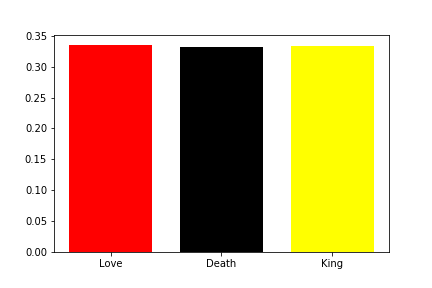
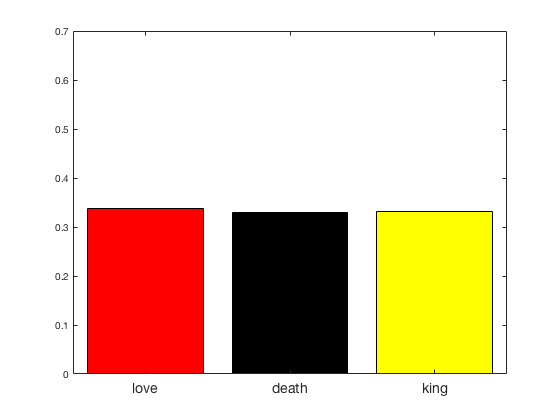
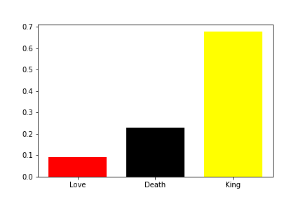

[](http://quantlet.de/)

## [](http://quantlet.de/) **LDA_generate_document_by_setting_hyperparameters** [](http://quantlet.de/)

```yaml


Name of Quantlet: LDA_generate_document_by_setting_hyperparameters

Published in: LDA-DTM

Description: Simulated article using different Dirichlet hyperparameters 

Keywords: LDA, Dirichlet, Simulation, 

Author: Xinwen Ni

Submitted:  01 OCT 2018


```







### MATLAB Code
```matlab

% Author: Xinwen Ni 
% 


clear
clc

% setting the topice and related words
topic_shakespeare={'love','death','king'};
topic={'Education','Economy','Transport'};
topic_edu={'University','Teacher','Course'};
topic_econ={'Market','Company','Finance'};
topic_trans={'Train','Car','Airplane'};

picked_topic=topic_shakespeare;


% time of simulation
n = 10000;

% dirictlet parameters 
alpha = [1 1 1 ; 10 10 10; 2 5 15]; % control document via topic
beta= [1 1 1 ; 10 10 10; 2 5 15]; % control topic via words


% probability matrices of document to topic
theta1= drchrnd(alpha(1,:),n);
theta2= drchrnd(alpha(2,:),n);
theta3= drchrnd(alpha(3,:),n);

% probability matrices of topic to word
phi1= drchrnd(beta(1,:),n);
phi2= drchrnd(beta(2,:),n);
phi3= drchrnd(beta(3,:),n);


% assume there is only one topic, generate m different documents according
% to different dirictlet perameters 
COUNT=[];
prob_matrix=[];
% here fixed the number of words in the topic 
for m=1:length(beta(:,1))
    % prepare the room to store the generated text file,and the count for each
    % word 
    text=[];
    index=zeros(1,length(n));
    count=zeros(1,length(picked_topic));
    % simulate the probability matrices
    phi= drchrnd(beta(m,:),n);
    for i=1:n
        x=rand;
        if x<phi(i,1)
           text=[text string(' ') string(picked_topic(1))];
           index(i)=1;
           count(1,1)=count(1,1)+1;
        elseif x<phi(i,1)+phi(i,2)
           text=[text string(' ') string(picked_topic(2))];
           index(i)=2;
           count(1,2)=count(1,2)+1;
        else
           text=[text string(' ') string(picked_topic(3))];
           index(i)=3;
           count(1,3)=count(1,3)+1;
        end       
    end
    % store the generated text 
    fname=['Text_' num2str(m) '.txt'];
    fid=fopen(fname,'w');
    fprintf(fid, '%s', text);
    fclose(fid);
    
    
    COUNT=[COUNT; count];
    prob_matrix=[prob_matrix; count/n];
    
     % plot the probablity   
    color=['r','k','y'];

    for k=1:length(prob_matrix(m,:))
        h=bar(k,prob_matrix(m,k),color(k));
        hold on
%          set(gca,'XTickLabel',picked_topic(k));        
    end
    aa=1:length(picked_topic);
    set(gca, 'XTick', aa)
    set(gca, 'XTickLabel', picked_topic)
    % set(gcf, 'color', 'none');
    ax = ancestor(h, 'axes');
    ylim([0 0.7])
    xrule = ax.XAxis;
    xrule.FontSize = 14;

    fname1=['Probability_bargraph_' num2str(m) '.fig'];
    saveas(h,fname1);
    hold off
%      clf

end


```

automatically created on 2019-02-04